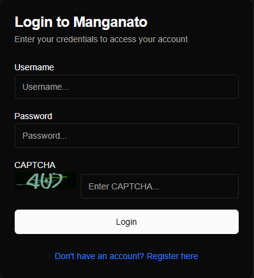
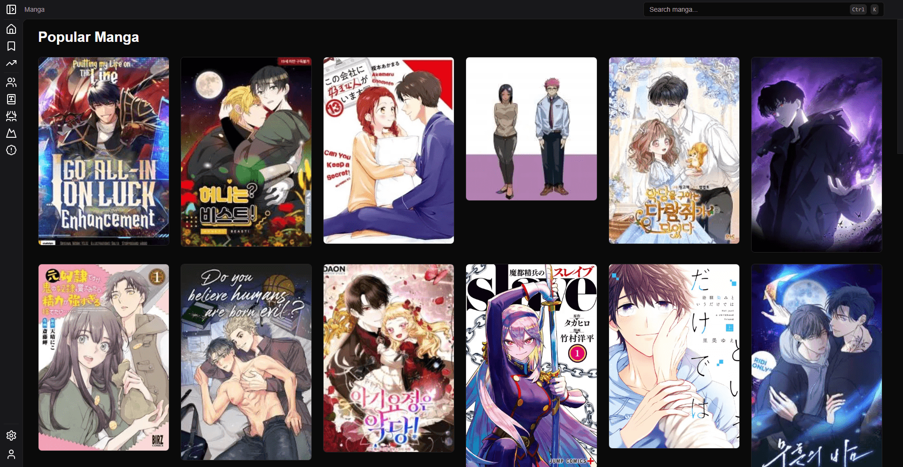
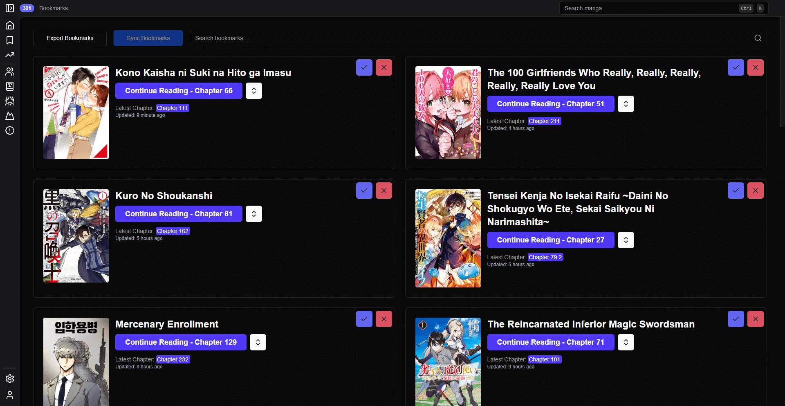
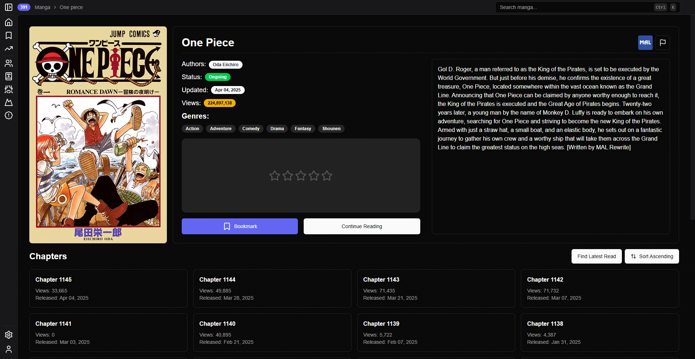
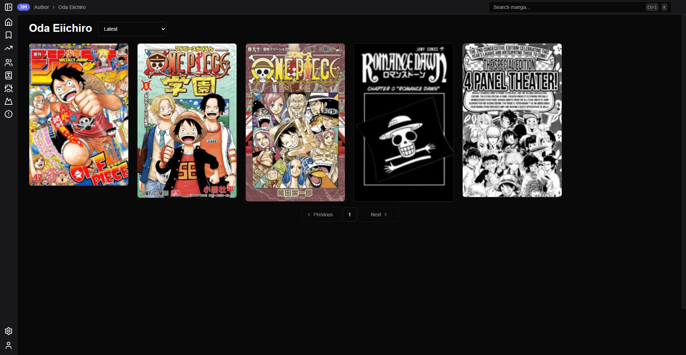

<p align="center">
  
</p>

<h1 align="center">灯 - Akari</h1>

<div align="center">
    
    
    
    
</div>

Akari is a Next.js application designed to provide an enhanced manga reading experience for [Manganato](https://manganato.gg/) users. It leverages Manganato as a backend, allowing users to manage and retain their bookmarks directly within the application.

## Table of Contents

- [Features](#features)
- [Settings](#settings)
- [Technical Stack](#technical-stack)
- [Getting Started](#getting-started)
    - [Online Usage](#online-usage)
    - [Local Installation](#local-installation)

# Features

## Reader Experience

- **Enhanced Reading Interface:** Clean, modern UI optimized for manga reading
- **Multiple View Modes:** Support for both individual page reading for manga and list reading for manhwa.
- **Responsive Design:** Fully responsive interface that works on mobile and desktop

## Manga Management

- **Genre Filtering:** Browse manga by specific genres
- **Popular Manga Section:** Discover trending and popular manga
- **Latest Updates:** Stay informed about newly added chapters

## Bookmarks and Sync

- **MyAnimeList Integration:**
    - Sync with MyAnimeList (MAL) account
    - Enhanced manga information from MAL
- **Bookmark Management:**
    - Sync bookmarks with Manganato account
    - Quick bookmark removal from manga pages
    - Search through bookmarked manga
    - Up-to-date chapter tracking
    - Last read chapter tracking

# Settings

> ⊕ indicates features only available on the official website.

## General

| Setting          | Default | Description                                                                                                                                                |
| ---------------- | ------- | ---------------------------------------------------------------------------------------------------------------------------------------------------------- |
| Theme            | System  | Choose between Light, Dark, or System color theme                                                                                                          |
| Fetch MAL Data ⊕ | Enabled | Uses the public `jikan` and `MalSync` APIs to fetch manga info to put into the database, this helps improve akari both locally and on the official website |
| Fancy Animations | Enabled | Toggle advanced animations for a richer experience                                                                                                         |

## Manga

| Setting            | Default | Description                            |
| ------------------ | ------- | -------------------------------------- |
| Manga Server       | 1       | Chooses the manga server to fetch from |
| Show Page Progress | Enabled | Enables or disables the progress bar   |

## Notifications

| Setting      | Default | Description                                                |
| ------------ | ------- | ---------------------------------------------------------- |
| Use Toasts   | Enabled | Enable or disable notification toasts                      |
| Login Toasts | Enabled | Show warnings when you aren't logged in to a service (MAL) |

## Cache

| Setting     | Default | Description       |
| ----------- | ------- | ----------------- |
| Clear Cache | N/A     | Clears all caches |

# Technical Stack

- **Frontend**: Next.js 15, React 19, TailwindCSS
- **Database**: Supabase integration for manga data
- **Authentication**: Built-in Manganato authentication and MyAnimeList OAuth

# Getting Started

## Online Usage

Visit the [Akari Website](https://akari-psi.vercel.app/) to start reading manga instantly.

If you have a [Manganato](https://manganato.gg/) account, press the account button in the top right and sign in to your account as normal.



After you've been logged in, you can use it as you normally would.

<details>
  <summary>Showcase of Pages</summary>

### Front Page



### Bookmarks



### Manga



### Author



### Genre


</details>

## Local Installation

If you prefer to run Akari locally, follow these steps.

### Prerequisites

Before running Akari, make sure you have the following installed:

- [Node.js](https://nodejs.org/)
- [npm](https://www.npmjs.com/) or [yarn](https://yarnpkg.com/)

### Installation

1. Clone the repository:

```bash
git clone https://github.com/sn0w12/Akari
cd Akari
```

2. Install dependencies:

If you are using yarn, replace npm with yarn.

```bash
npm install
```

### Running the Development Server

To start the development server, run:

```bash
npm run dev
```

> **Note**: When running locally, MyAnimeList authentication only works on specific localhost ports. Currently supported ports are: 3000, 3016, 3456, 3789, and 4000. You can modify the port in your `package.json` scripts by adding a `-p` flag with `next dev / start`.

Open http://localhost:3000 in your browser to see the application.

### Production Build

To build the app for production:

```bash
npm run build
npm run start
```

# DMCA disclaimer

The developers of this application do not have any affiliation with the content available in the app.
It collects content from sources that are freely available through any web browser
