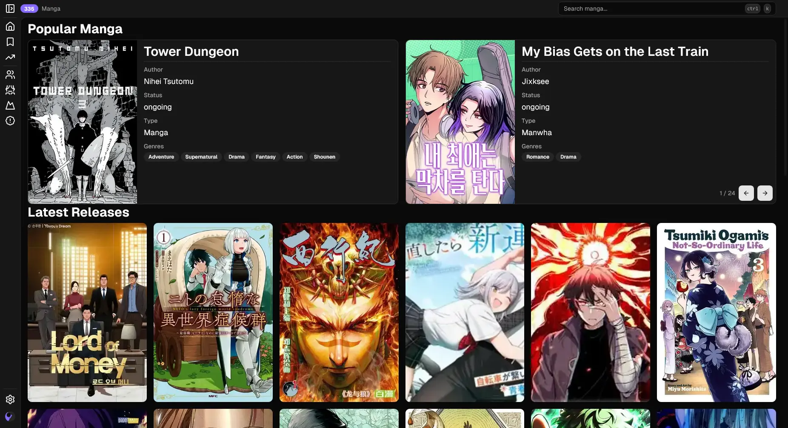
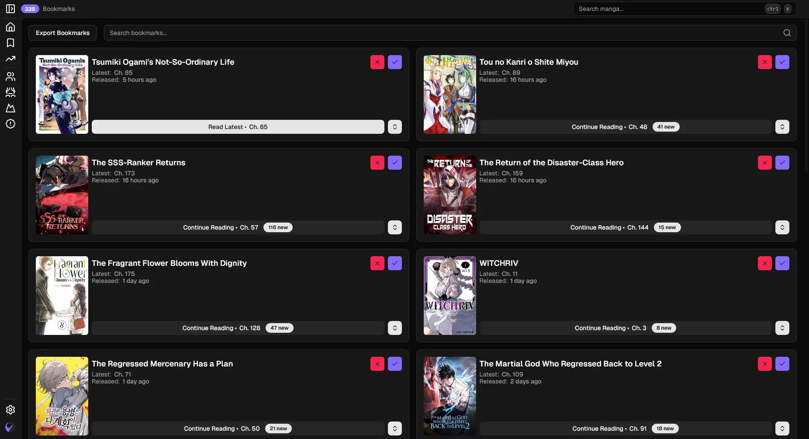
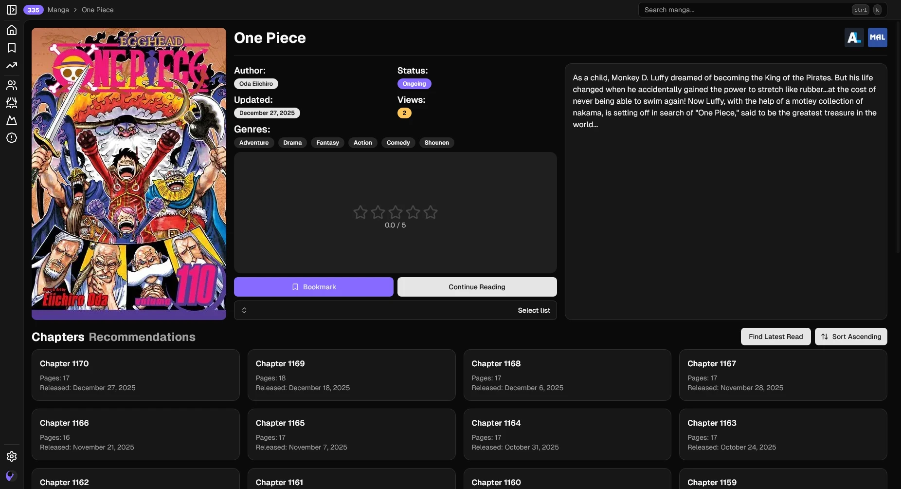
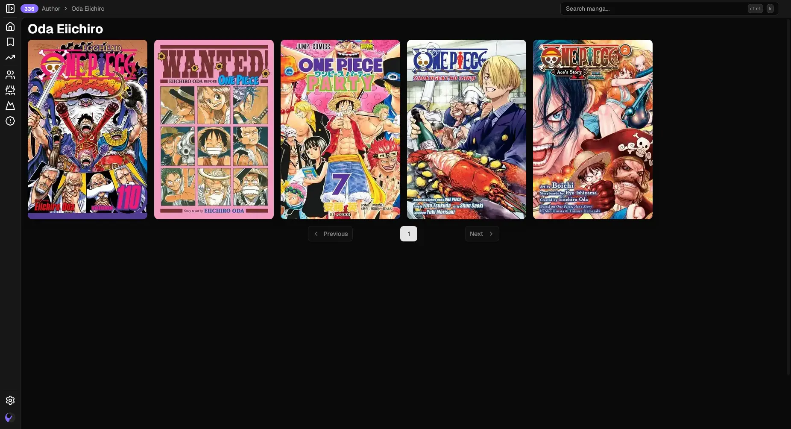

<p align="center">
  
</p>

<h1 align="center">灯 - Akari</h1>

<div align="center">
    
    
    
    
</div>

Akari is a high-quality, open-source manga reader built with Next.js. It provides an enhanced reading experience, allowing users to manage bookmarks and reading history seamlessly.

## Table of Contents

- [Features](#features)
- [Getting Started](#getting-started)
    - [Online Usage](#online-usage)
    - [Local Installation](#local-installation)
- [Screenshots](#screenshots)

## Features

### Reader Experience

- **Enhanced Reading Interface:** Clean, modern UI optimized for manga reading
- **Multiple View Modes:** Support for both individual page reading for manga and list reading for manhwa
- **Responsive Design:** Fully responsive interface that works on mobile and desktop

### Manga Management

- **Genre Filtering:** Browse manga by specific genres
- **Popular Manga Section:** Discover trending and popular manga
- **Latest Updates:** Stay informed about newly added chapters

### Bookmarks and Sync

- **External Service Integration:** Sync with MyAnimeList (MAL) and AniList accounts to import your saved manga
- **Bookmark Management:** Save, organize, and track your favorite manga titles with up-to-date chapter progress

## Getting Started

### Online Usage

Visit the [Akari Website](https://akarimanga.dpdns.org/) to start reading manga instantly.

### Local Installation

If you prefer to run Akari locally, follow these steps. Your akari account will not be available if running locally.

#### Prerequisites

- [Node.js](https://nodejs.org/)
- [npm](https://www.npmjs.com/) or [yarn](https://yarnpkg.com/)

#### Installation

1. Clone the repository:

    ```bash
    git clone https://github.com/sn0w12/Akari
    cd Akari
    ```

2. Configure environment variables:

    Create a `.env` file in the root directory by copying the example file:

    ```bash
    cp .env.example .env
    ```

    Edit `.env` and configure the following variables:

    **Required:**
    - `NEXT_PUBLIC_API_URL` - The API endpoint for fetching manga content, unless you know what you are doing, set it to `https://api.akarimanga.dpdns.org`

    **Optional:**
    - `NEXT_PUBLIC_HOST` - Your website host (e.g., `akari.mydomain.com`) used for metadata
    - `NEXT_PUBLIC_ANI_CLIENT_ID` - AniList client ID for AniList integration
    - `NEXT_PUBLIC_MAL_CLIENT_ID` - MyAnimeList client ID for MAL integration
    - `NEXT_PUBLIC_PLAUSIBLE_ENDPOINT` - Your Plausible Analytics endpoint (e.g., `https://plausible.yourdomain.com/api/event`)
    - `DISABLE_STATIC_GENERATION` - Set to `1` to disable static generation (default: `0`)
    - `GENERATE_SITEMAP` - Set to `1` to enable sitemap generation (default: `0`)
    - `NEXT_PUBLIC_VAPID_PUBLIC_KEY` - VAPID public key for web push notifications
    - `NEXT_PUBLIC_SUPABASE_URL` - Supabase URL for account functionality
    - `NEXT_PUBLIC_SUPABASE_PUBLISHABLE_OR_ANON_KEY` - Supabase publishable/anon key for accounts

3. Install dependencies:

    ```bash
    npm install
    ```

4. Start the development server:

    ```bash
    npm run dev
    ```

Open [http://localhost:3000](http://localhost:3000) in your browser to view the application.

#### Production Build

To build for production:

```bash
npm run build
npm run start
```

## Screenshots

### Front Page



### Bookmarks



### Manga



### Author



### Genre


</details>

## Disclaimer

The developers of this application do not have any affiliation with the content available in the app. It collects content from sources that are freely available through any web browser.
