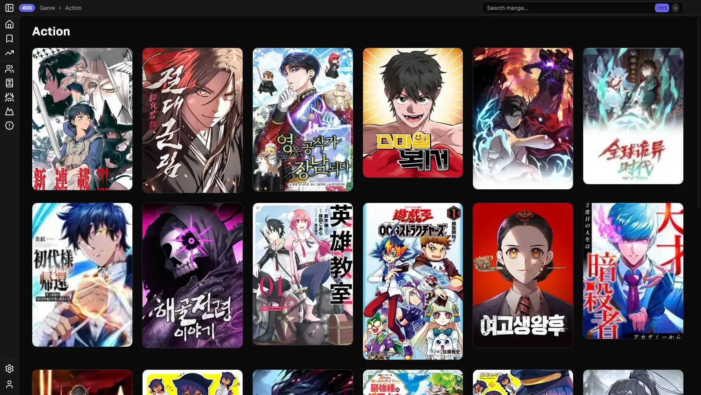

<p align="center">
  
</p>

<h1 align="center">灯 - Akari</h1>

<div align="center">
    
    
    
    
</div>

Akari is a high-quality, open-source manga reader built with Next.js. It provides an enhanced reading experience, allowing users to manage bookmarks and reading history seamlessly.

## Table of Contents

-   [Features](#features)
-   [Settings](#settings)
-   [Technical Stack](#technical-stack)
-   [Getting Started](#getting-started)
    -   [Online Usage](#online-usage)
    -   [Local Installation](#local-installation)

# Features

## Reader Experience

-   **Enhanced Reading Interface:** Clean, modern UI optimized for manga reading
-   **Multiple View Modes:** Support for both individual page reading for manga and list reading for manhwa.
-   **Responsive Design:** Fully responsive interface that works on mobile and desktop

## Manga Management

-   **Genre Filtering:** Browse manga by specific genres
-   **Popular Manga Section:** Discover trending and popular manga
-   **Latest Updates:** Stay informed about newly added chapters

## Bookmarks and Sync

-   **MyAnimeList Integration:**
    -   Sync with MyAnimeList (MAL) account
    -   Enhanced manga information from MAL
-   **Bookmark Management:**
    -   Save and organize your favorite manga titles
    -   Quick bookmark removal from manga pages
    -   Search through bookmarked manga
    -   Up-to-date chapter tracking
    -   Last read chapter tracking

# Settings

## General

| Setting            | Default | Description                                           |
| ------------------ | ------- | ----------------------------------------------------- |
| Theme              | System  | Select the application theme.                         |
| Fancy Animations   | Enabled | Such as manga detail pages cover image.               |
| Navigation Restore | Enabled | Restore the last visited page when reopening the app. |
| Show Toasts        | Enabled | Show toast notifications for various actions.         |
| Login Toasts       | Enabled | Show warnings when you aren't logged in to a service. |

## Manga

| Setting            | Default | Description                                            |
| ------------------ | ------- | ------------------------------------------------------ |
| Show Page Progress | Enabled | Shows a progress bar at the side/ bottom when reading. |
| Strip Reader Width | 144     | Width of the strip reader.                             |

## Shortcuts

| Setting               | Default      | Description                           |
| --------------------- | ------------ | ------------------------------------- |
| Show Shortcuts        | Enabled      | Enable or disable keyboard shortcuts. |
| Search Manga          | Ctrl+K       | Shortcut to search manga.             |
| Toggle Sidebar        | Ctrl+B       | Shortcut to toggle the sidebar.       |
| Open Settings         | Ctrl+,       | Shortcut to open settings.            |
| Open Account          | Ctrl+.       | Shortcut to open account page.        |
| Navigate to Bookmarks | Ctrl+Shift+B | Shortcut to navigate to bookmarks.    |

# Technical Stack

-   **Frontend**: Next.js 15, React 19, TailwindCSS
-   **Authentication**: MyAnimeList OAuth and user accounts

# Getting Started

## Online Usage

Visit the [Akari Website](https://akarimanga.dpdns.org/) to start reading manga instantly.

Create an account to sync your bookmarks and reading progress across devices.


After you've been logged in, you can use it as you normally would.

<details>
  <summary>Showcase of Pages</summary>

### Front Page


### Bookmarks


### Manga


### Author


### Genre



</details>

## Local Installation

If you prefer to run Akari locally, follow these steps.

### Prerequisites

Before running Akari, make sure you have the following installed:

-   [Node.js](https://nodejs.org/)
-   [npm](https://www.npmjs.com/) or [yarn](https://yarnpkg.com/)

### Installation

1. Clone the repository:

```bash
git clone https://github.com/sn0w12/Akari
cd Akari
```

2. Install dependencies:

If you are using yarn, replace npm with yarn.

```bash
npm install
```

### Running the Development Server

To start the development server, run:

```bash
npm run dev
```

> **Note**: When running locally, MyAnimeList authentication only works on specific localhost ports. Currently supported ports are: 3000, 3016, 3456, 3789, and 4000. You can modify the port in your `package.json` scripts by adding a `-p` flag with `next dev / start`.

Open http://localhost:3000 in your browser to see the application.

### Production Build

To build the app for production:

```bash
npm run build
npm run start
```

# DMCA disclaimer

The developers of this application do not have any affiliation with the content available in the app.
It collects content from sources that are freely available through any web browser
